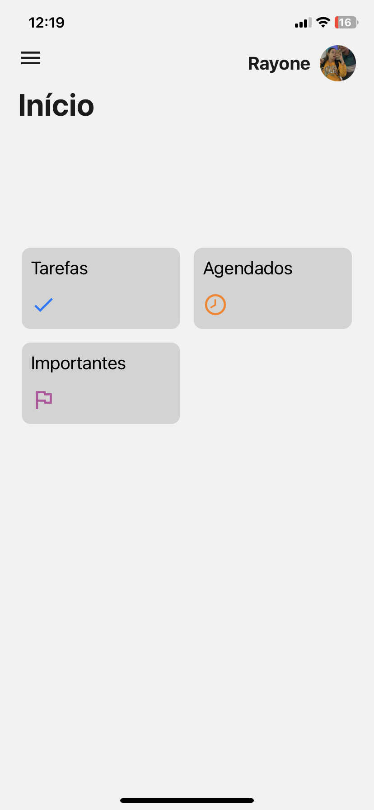
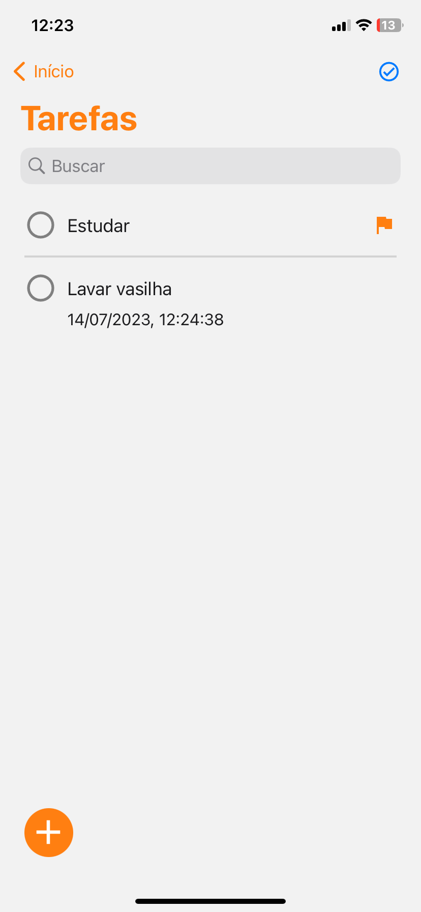
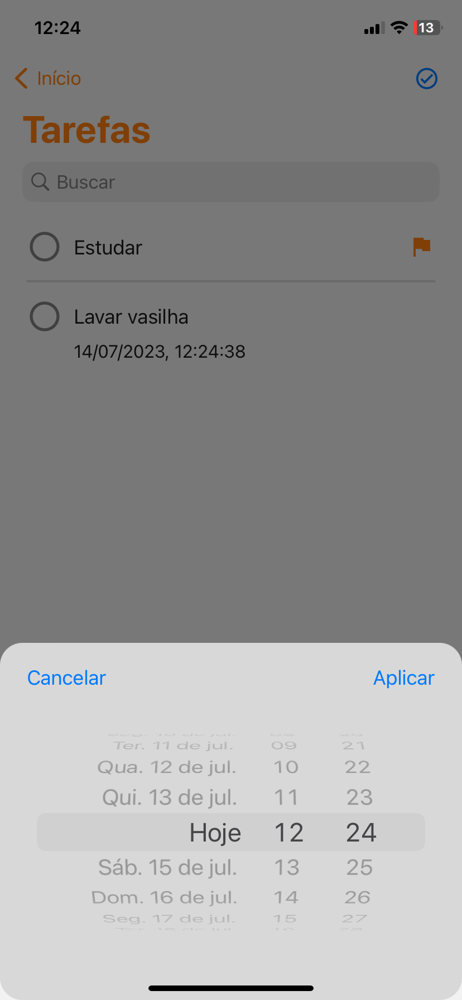
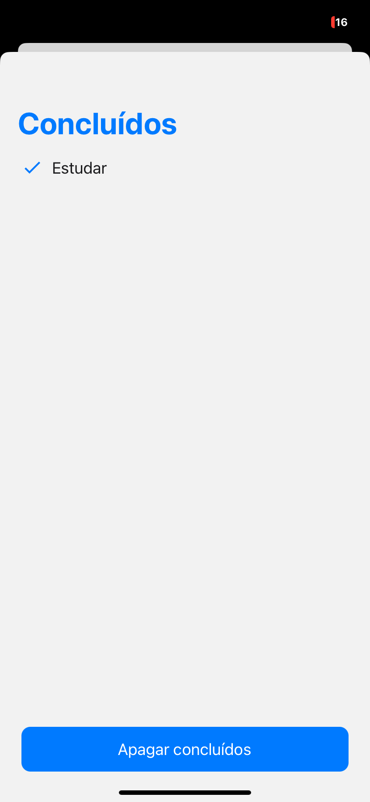

# todo
O projeto todo-app é um aplicativo de lista de tarefas que permite que você se lembre de realizar determinadas tarefas, marque tarefas como importantes e se organize melhor. Ele é uma ferramenta útil para quem deseja manter o controle de suas tarefas diárias e se manter organizado.

  
  
  
  

